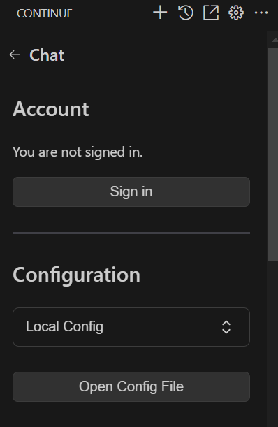

# Coding-support-tool-using-local-llm-with-proxy

このリポジトリはプロキシ環境下でollamaを使ってローカルLLMサーバーを立ち上げて、ClineやContinueといったコーディング支援ツールを動作させるまでの手順を示したリポジトリです。

## ローカルLLMによる開発支援ツールとは

近年、DevinやGitHub CopilotのようにLLMを利用してソフトウェア開発を支援するツールが増えてきています。
一方でそのようなツールを利用することで、個人情報や機密情報が外部に流出するリスクや利用するためのコストの問題があります。
そのような問題を解決するために、内部に独自のLLMサーバーを立てて運用するローカルLLMを用いる方法があります。
本リポジトリでは、主にプロキシ環境下でローカルLLMをセットアップして、開発支援ツールを導入する方法について説明します。

## Clineの特徴

ClineはDevinに代表されるソフトウェアのコード作成からテスト実行までを一括で任せることができるAIエージェントです。
基本的にプロンプトのみでソフトウェアの開発を行うことができるというメリットがあります。
一方でソフトウェアの動作保証はなく、場合によっては間違った動作によってシステムを破損させる危険性があります（例えば、コンピュータ内部の重要なデータを消去されてしまうなど）。
そのため、ソフトウェア開発に十分な知識を持った上級者向けのツールといえます。

## Continueの特徴

ContinueはGitHub Copilotのようにソフトウェアのコード作成を支援してくれるツールです。
Clineのようにプロンプトを入力してあとは任せるような形ではなく、途中まで記述したコードの補間やデバッグ支援といった形でコーディングの支援をしてくれます。

## ローカルLLMサーバー導入手順

1. /etc/environmentなどにHTTP_PROXYやHTTPS_PROXYの設定を記述しておく

2. 以下のjsonのひな形を元に、~/.docker/config.jsonファイルを書き換えてDockerのプロキシを設定する

   ```json
   {
       "proxies":
       {
               "default":
               {
                       "httpProxy": "http://address:port",
                       "httpsProxy": "http://address:port",
                       "noProxy": "127.0.0.0/8,localhost"
               }
       }
   }
   ```

3. 本リポジトリをサーバー機にクローンする

   ```
   git clone https://github.com/hijimasa/Cline_for_local_llm_with_proxy.git
   ```

4. Dockerイメージをビルドする

   ```
   cd Cline_for_local_llm_with_proxy
   bash ./build_docker.sh
   ```

5. コンテナを立ち上げる

   HTTP_PROXYなどの環境変数の設定が反映されるようになっています。

   ```
   bash ./launch_container.sh
   ```

## Cline設定手順

1. Visual Studio Codeの拡張機能でClineを検索してインストールする

2. 左端に表示されるロボットのようなアイコンをクリックして、Clineの設定画面を開く

3. 以下の画像のように、Clineの設定で使用するLLMにOllamaを設定して、アドレスとポートを指定、使用するモデルを選択する（指定するアドレスの最後にスラッシュを付けてしまうと正しく動かないので注意すること）
   

4. メニューバーの「ファイル」->「ユーザ設定」->「設定」からProxyを検索して、「Http: No Proxy」にサーバーのIPアドレスを指定する

## Continue設定手順
1. Visual Studio Codeの拡張機能でContinueを検索してインストールする

2. 左端に表示されるアイコンをクリックして、Continueの画面を開く

3. 画像のような画面が表示されるので、右上の歯車のアイコンをクリックして設定画面を開く

   

4. 「Open Config File」ボタンをクリックしてConfigファイルを開く

   

5. [サンプルのconfigファイル](./sample_continue_config.json)のように設定を更新する（ただし、サーバーアドレスはサーバーに合わせて適宜変更すること）

6. メニューバーの「ファイル」->「ユーザ設定」->「設定」からProxyを検索して、「Http: No Proxy」にサーバーのIPアドレスを指定する

7. 「ファイル」->「ユーザ設定」->「設定」->「Continue: Telemetry Enabled」のチェックを外す。
   （外しておかないと、匿名化されるとはいえ使用情報が収集されてしまうので注意すること）

## 参考URL
- Clineに対応させるためにModefileを編集する必要があったため、以下のサイトを参考にしています
  https://note.com/cppp_cpchan/n/n92c7795f5939#825209eb-6a46-4197-90b7-15ad73c7ae8e

- Continueに関する参考サイトです
  https://qiita.com/SH2/items/1d5ee5b898046ff89458
